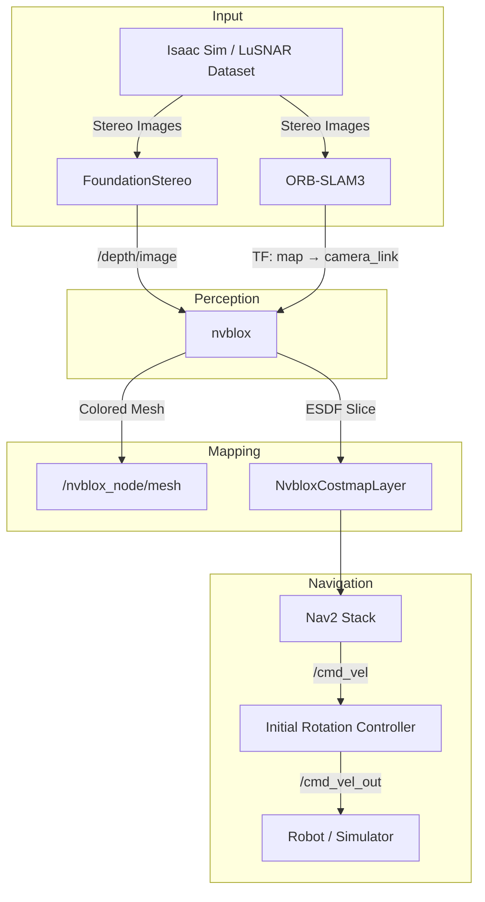

# Stereo_autonomous

**GPU-Accelerated Visual SLAM & Autonomous Navigation Pipeline for Planetary Rovers**

Sreo_autonomous is a ROS 2 pipeline that integrates stereo visual SLAM, deep learning-based depth estimation, dense 3D reconstruction, and autonomous navigation for unstructured terrain. It combines **ORB-SLAM3**, **FoundationStereo**, **nvblox**, and **Nav2** into a unified system orchestrated by a single shell script.

> Built on **Ubuntu 24.04** · **ROS 2 Jazzy** · **CUDA 12.0** · **Python 3.12**

---

## Table of Contents

- [Overview](#overview)
- [Key Features](#key-features)
- [System Architecture](#system-architecture)
- [System Components](#system-components)
- [Coordinate System (TF Tree)](#coordinate-system-tf-tree)
- [Prerequisites](#prerequisites)
- [Installation](#installation)
- [Usage](#usage)
- [Project Structure](#project-structure)
- [Visualization](#visualization)
- [Debugging](#debugging)

---

## Overview

The pipeline processes stereo camera inputs to perform real-time localization, 3D mapping, and autonomous navigation. Two operating modes are supported:


| Mode | Source | Use Case |
|------|--------|----------|
| **Simulation** (`--sim`) | NVIDIA Isaac Sim | Live stereo feed via ROS 2 bridge |
| **Dataset** (`--dataset`) | LuSNAR lunar dataset | Offline evaluation with ground truth |

**Core workflow:**

1. **Depth Estimation** — FoundationStereo converts stereo pairs to dense depth maps (GPU)
2. **Localization** — ORB-SLAM3 estimates 6-DoF camera pose from stereo features
3. **3D Reconstruction** — nvblox builds TSDF/ESDF volumes and generates a colored mesh
4. **Navigation** — Nav2 plans and follows paths using nvblox costmap layers

---

## Key Features

- **Stereo Visual SLAM** — Real-time localization with ORB-SLAM3, publishing map→camera TF
- **Dense 3D Mapping** — TSDF/ESDF reconstruction and mesh generation via nvblox (GPU)
- **Deep Stereo Depth** — FoundationStereo inference in a dedicated Conda environment (Python 3.12)
- **Autonomous Navigation** — Nav2 with NvbloxCostmapLayer for obstacle-aware path planning
- **Dual Mode** — Seamless switching between Isaac Sim and LuSNAR dataset
- **Single-Script Launch** — `run_pipeline.sh` orchestrates all components with granular flags
- **Automated Experiments** — `run_scenarios.sh` runs multi-scenario evaluations with metrics logging

---

## System Architecture



---

## System Components

### Perception & Localization

| Component | Package | Description |
|-----------|---------|-------------|
| **Stereo SLAM** | `orb_slam3_ros2` | `stereo_slam` executable. Computes camera pose and publishes the `map` → `camera_link` transform. |
| **Depth Estimation** | `foundation_stereo_ros2` | `depth_node.py`. Runs FoundationStereo in the `foundation_stereo_py312` Conda env. Publishes `/depth/image` and `/depth/camera_info`. |
| **Dataset Publisher** | `orb_slam3_ros2` | `dataset_publisher` executable. *(Dataset mode only)* Publishes stereo images and ground truth from LuSNAR. |

### Mapping & Reconstruction

| Component | Package | Description |
|-----------|---------|-------------|
| **nvblox** | `nvblox_ros` (apt) | Consumes depth + pose to build TSDF → ESDF → mesh. Publishes 3D mesh, ESDF pointcloud, and 2D costmap slice. |
| **NvbloxCostmapLayer** | `nvblox_nav2` (patched) | Nav2 costmap plugin. Subscribes to `/nvblox_node/static_map_slice` and injects obstacles into both local and global costmaps. |

### Navigation (Nav2)

| Component | Package | Description |
|-----------|---------|-------------|
| **Planner Server** | `nav2_planner` | NavFn (A*/Dijkstra) global path planner. |
| **Controller Server** | `nav2_controller` | DWB local planner for velocity commands. |
| **BT Navigator** | `nav2_bt_navigator` | Behavior tree for goal tracking and recovery. |
| **Initial Rotation** | `nvblox_integration` | `initial_rotation_controller.py`. In-place rotation toward goal before linear motion. |
| **Goal Pose Corrector** | `nvblox_integration` | `goal_pose_corrector.py`. Adjusts goal Z-height to match terrain. |
| **Goal Reached Stop** | `nvblox_integration` | `goal_reached_stop.py`. Ensures complete halt when goal is reached. |

### Utilities

| Component | Package | Description |
|-----------|---------|-------------|
| **Goal Sender** | `nvblox_integration` | `goal_sender.py`. Sends navigation goals from waypoints file or CLI. |
| **Metrics Logger** | `nvblox_integration` | `navigation_metrics_logger.py`. Logs localization/depth/navigation metrics to CSV. |
| **Ground Truth Publisher** | `nvblox_integration` | `ground_truth_publisher.py`. *(Sim only)* Publishes GT point cloud for comparison. |
| **Pose Plotter** | `nvblox_integration` | `pose_comparison_plot.py`. Real-time Matplotlib trajectory comparison. |

---

## Coordinate System (TF Tree)

```
map (global frame, SLAM origin)
 └── odom (static identity transform)
      └── base_link (robot center, ground_offset above terrain)
           └── camera_link (stereo camera frame)
```

- **`map` → `odom`**: Static identity (SLAM provides global localization directly)
- **`map` → `camera_link`**: Published by ORB-SLAM3
- **`camera_link` → `base_link`**: Static transform from camera extrinsics
- **`ground_offset`**: Configurable height of `base_link` above ground (default: 0.15 m)

---

## Prerequisites

### Hardware
- **GPU**: NVIDIA GPU with CUDA support (tested on RTX 5070 Ti)
- **VRAM**: ≥ 8 GB recommended (FoundationStereo + nvblox + elevation mapping)

### Software
- **OS**: Ubuntu 24.04 LTS
- **ROS 2**: Jazzy Jalisco
- **CUDA**: 12.x
- **Conda**: Miniconda or Anaconda (for FoundationStereo environment)
- **NVIDIA Isaac Sim**: *(Optional)* For simulation mode

> For detailed step-by-step installation, see [SETUP_GUIDE.md](SETUP_GUIDE.md) (한국어) or [SETUP_GUIDE_EN.md](SETUP_GUIDE_EN.md) (English).

---

## Installation

### Quick Start

```bash
# 1. Clone the workspace
git clone <repository_url> ~/Stereo_autonomous
cd ~/Stereo_autonomous

# 2. Clone external dependencies
cd deps
git clone https://github.com/UZ-SLAMLab/ORB_SLAM3.git
git clone https://github.com/NVlabs/FoundationStereo.git
git clone https://github.com/NVIDIA-ISAAC-ROS/isaac_ros_nvblox.git

# 3. Build ORB-SLAM3
cd ORB_SLAM3 && cd Vocabulary && tar -xf ORBvoc.txt.tar.gz && cd ..
chmod +x build.sh && ./build.sh && cd ..

# 4. Apply nvblox custom patch (thread-safety fix)
cd isaac_ros_nvblox
git apply ../../patches/isaac_ros_nvblox_custom.patch
cd ../..

# 5. Restore Conda environment for FoundationStereo
conda env create -f config/foundation_stereo_py312_env.yml

# 6. Install ROS 2 dependencies
rosdep install --from-paths src deps/isaac_ros_nvblox --ignore-src -r -y

# 7. Build the workspace
source /opt/ros/jazzy/setup.bash
colcon build --symlink-install
source install/setup.bash
```

> ⚠️ This is a condensed overview. See [SETUP_GUIDE.md](SETUP_GUIDE.md) for the full guide including system dependencies (Pangolin, Eigen, etc.).

---

## Usage

### Pipeline Script

```bash
./run_pipeline.sh [OPTIONS]
```

### Examples

```bash
# Full pipeline (simulation mode)
./run_pipeline.sh --all

# Full pipeline (dataset mode with LuSNAR)
./run_pipeline.sh --dataset --all

# SLAM + depth only
./run_pipeline.sh --slam --depth

# nvblox + Nav2 + RViz
./run_pipeline.sh --nvblox --nav --rviz

# Everything except SLAM viewer window
./run_pipeline.sh --all --no-slam-viz
```

### Flags

| Flag | Description |
|------|-------------|
| `--all` | Launch all components. |
| `--sim` | Simulation mode (Isaac Sim). Default. |
| `--dataset` | Dataset mode (LuSNAR). |
| `--slam` | Launch ORB-SLAM3. |
| `--depth` | Launch FoundationStereo depth node. |
| `--nvblox` | Launch nvblox 3D mapping. |
| `--nav` | Launch Nav2 navigation stack. |
| `--rviz` | Launch RViz2 visualization. |
| `--slam-viz` | Enable ORB-SLAM3 feature viewer. |
| `--depth-viz` | Enable depth map viewer. |
| `--pc-viz` | Enable Open3D point cloud overlay. |
| `--pose-plot` | Enable real-time pose comparison plot. |
| `--no-slam-viz` | Disable SLAM's internal viewer. |

### Automated Experiments

```bash
# Run multi-scenario experiments with metrics collection
./run_scenarios.sh
```

Results are saved to `data/scenario_results/` with per-run metrics CSVs.

### Stopping the Pipeline

```bash
./kill_pipeline.sh
```

---

## Project Structure

```
Sreo_autonomous/
├── run_pipeline.sh              # Main pipeline launcher
├── kill_pipeline.sh             # Kill all pipeline processes
├── run_scenarios.sh             # Multi-scenario experiment runner
├── README.md
├── SETUP_GUIDE.md               # Full installation guide (한국어)
├── SETUP_GUIDE_EN.md            # Full installation guide (English)
│
├── src/                         # ROS 2 source packages
│   ├── orb_slam3_ros2/          #   ORB-SLAM3 ROS 2 wrapper
│   ├── foundation_stereo_ros2/  #   FoundationStereo ROS 2 wrapper
│   ├── nvblox_integration/      #   nvblox + Nav2 integration (launch, config, helpers)

│
├── deps/                        # External dependencies (git cloned)
│   ├── ORB_SLAM3/               #   Visual SLAM library
│   ├── FoundationStereo/        #   Stereo depth estimation model
│   └── isaac_ros_nvblox/        #   NVIDIA nvblox ROS packages (patched)
│
├── data/                        # Datasets & experiment results
│   ├── LuSNAR/                  #   Lunar dataset (Moon_2, K.txt)
│   ├── waypoints.json           #   Navigation waypoints
│   ├── navigation_metrics_*.csv #   Collected metrics
│   ├── scenario_results/        #   Per-run experiment outputs
│   └── analysis_output/         #   Generated plots & summaries
│
├── assets/                      # Simulation & SLAM config files
│   ├── sim_slam_settings.yaml   #   ORB-SLAM3 settings for sim
│   ├── sim_intrinsics.txt       #   Camera intrinsics for sim
│   └── fastdds_udp_only.xml     #   DDS transport config
│
├── config/                      # Environment & dependency info
│   ├── foundation_stereo_py312_env.yml  # Conda env export
│   ├── ros2_dependencies.txt    #   rosdep dependency list
│   └── dependencies_info.md     #   Dependency documentation
│
├── patches/                     # Patches for external dependencies
│   ├── isaac_ros_nvblox_custom.patch  # Thread-safety + mesh fix
│   └── ORB-SLAM3.patch          #   Build compatibility patch
│
├── scripts/                     # Utility scripts
│   ├── analyze_nav_metrics.py   #   Metrics analysis & visualization
│   └── trim_and_compress_video.sh  # Video post-processing
│
├── docs/                        # Component documentation
│   ├── depth_node_guide.md
│   ├── nvblox_node_guide.md
│   ├── orb_slam3_node_guide.md
│   └── nav2_stack_guide.md
│
├── debug/                       # Debugging & diagnostic scripts
│   ├── analyze_depth.py
│   ├── debug_nvblox_live.py
│   ├── monitor_cmd_vel.sh
│   └── ...
│
├── build/                       # colcon build output
├── install/                     # colcon install output
└── log/                         # colcon build logs
```

---

## Visualization

### RViz2 (Main)

- **3D Mesh**: Real-time colored mesh from nvblox (`/nvblox_node/mesh`)
- **Costmaps**: ESDF-based 2D costmap slices (`/nvblox_node/static_map_slice`)
- **Navigation**: Global path, local plan, robot footprint
- **Ground Truth**: *(Sim only)* Environment point cloud overlay

### Component Viewers

| Viewer | Flag | Description |
|--------|------|-------------|
| ORB-SLAM3 | `--slam-viz` | Tracked ORB keypoints and local map |
| Depth Map | `--depth-viz` | Colorized depth output from FoundationStereo |
| Point Cloud | `--pc-viz` | Open3D overlay — predicted (orange) vs ground truth (cyan) |
| Pose Plot | `--pose-plot` | Matplotlib trajectory comparison (SLAM vs GT) |


## License

This project integrates several open-source components under their respective licenses:
- [ORB-SLAM3](https://github.com/UZ-SLAMLab/ORB_SLAM3) — GPLv3
- [FoundationStereo](https://github.com/NVlabs/FoundationStereo) — NVIDIA License
- [isaac_ros_nvblox](https://github.com/NVIDIA-ISAAC-ROS/isaac_ros_nvblox) — Apache 2.0
- [Nav2](https://github.com/ros-navigation/navigation2) — Apache 2.0
